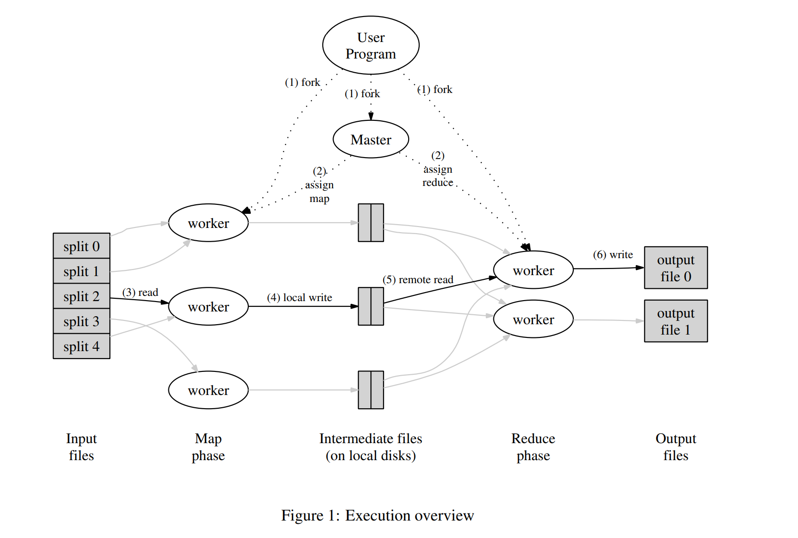

# MapReduce课程笔记

* [ 论文地址](http://nil.csail.mit.edu/6.824/2021/papers/mapreduce.pdf)


MapReduce 是一种用于处理和生成大型数据集的编程模型和相关实现。

map：处理key/value对产生中间的key/value对集合。

reduce：合并具有**相同中间key**的中间value。

系统的目标：以这种functional style的程序会自动并行化并在大型商用机器集群上执行。 运行时系统负责对输入数据进行分区、在一组机器上调度程序执行、处理机器故障以及管理所需的机器间通信等细节。 这使得没有任何并行和分布式系统经验的程序员可以轻松地利用大型分布式系统的资源。


## Example: Word Count

用户所需写的代码：
```
map(String key, String value):
// key: document name
// value: document contents
for each word w in value:
EmitIntermediate(w, "1");

reduce(String key, Iterator values):
// key: a word
// values: a list of counts
int result = 0;
for each v in values:
result += ParseInt(v);
Emit(AsString(result));
```


其他常见应用：

* Distributed Grep

* Count of URL Access Frequency

* Reverse Web-Link Graph

* Term-Vector per Host

* Inverted Index

* Distributed Sort


## 执行流程

(1)Map调用怎么分布到不同机器上： 把输入数据分区（partition） --> M splits,这m块可以被不同的机器并行执行。

(2)Reduce分布到不同机器：把中间键分区到R块，（使用patitioning函数，比如hash(key)modR）

流程图如下：




* Q1:怎么把输入的文件分区？

  ans：GFS divides each file into 64 MB blocks, and stores several copies of each block (typically 3 copies) on different machines.论文的使用环境是由底层的GFS提供。
* Q2：map产生的输出也需要分为R个区，保存在自身磁盘并告知master，Master怎么调度减少网络IO？
  
  ans：map需要的输入文件，master会考虑分布情况安排，reduce一般需要从所有机器上拉取数据，安排的意义没有那么大。
* Q3：Reduce阶段需要根据key来排序，然后通过迭代器把key和key对应的集合传入到reduce函数。reduce阶段需要等待map阶段结束吗？
* Q4 分区到R块与最后结果的表示有关吗，还是只是根据机器并行数量作决定？
  
  ans：Furthermore, R is often constrained by users because  the output of each reduce task ends up in a separate output file.
* Q5假设reduce阶段时访问数据不到（如先前完成任务的worker失联），此时master做什么操作？
  
  ans：Completed map tasks are re-executed on a failure because their output is stored on the local disk(s) of the failed machine and is therefore inaccessible. Completed reduce tasks do not need to be re-executed since theiroutput is stored in a global file system.


## MapReduce特点

MapReduce scales well:

  N "worker" computers get you Nx throughput.
    Maps()s can run in parallel, since they don't interact.
    Same for Reduce()s.
  So you can get more throughput by buying more computers.

MapReduce hides many details:

  sending app code to servers
  tracking which tasks are done
  moving data from Maps to Reduces
  balancing load over servers
  recovering from failures

However, MapReduce limits what apps can do:

  No interaction or state (other than via intermediate output).
  No iteration, no multi-stage pipelines.
  No real-time or streaming processing.

Input and output are stored on the GFS cluster file system

  MR needs huge parallel input and output throughput.
  GFS splits files over many servers, in 64 MB chunks
    Maps read in parallel
    Reduces write in parallel
  GFS also replicates each file on 2 or 3 servers
  Having GFS is a big win for MapReduce


## 容错分析

Work Failure：master会周期轮询worker，如果得不到回复，master会标记worker错误，并更改分配给该work任务的状态，这样调度器可以重新安排其他机器完成这个任务。所以map和reduce  函数应该能多次执行，（functional style）。运行相同reduce任务的机器会写相同的函数到gfs中，建立一个中间文件，然后重命名（atomic）。

Master Failure:单独这台机器故障概率很低，所以论文直接abortMapReduce计算。


## 改进

* Partitioning Function
* Ordering Guarantees
* Combiner Function
* Input and Output Types
* Side_effects
* Skipping Bad Records
* Local Execution
* Status Information