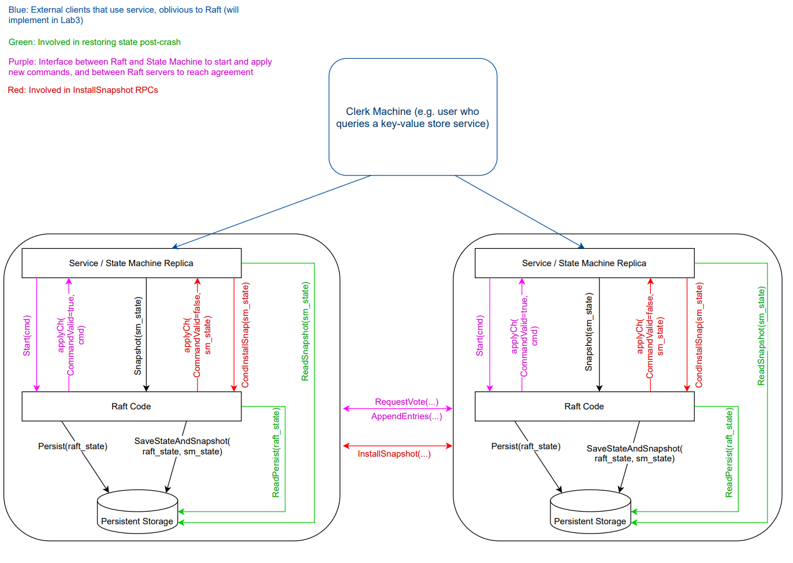

# Implementation
之前写的代码是根据实验一步一步来完成，比如实验a选举就只用我觉得完成选举需要使用的rpc和相应的结构与参数，并且整个实验一开始也不是完全根据图2来实现，自己有一些些变动，比如设置log[N].term = currentTerm当时感觉不必要，就没有添加这个条件，后面果然触发了fig8的bug，还有一些其他的设计一开始写法有一些些不同，但是如果有这样的不一致就需要修改某些判断来符合这一点。所以后面愈发修改愈发觉得raft设计得很精妙，每一处都严丝合缝。本次总结是重构之前的代码，是之完全符合raft规范，并且符合以下要求。
+ 规范化log输出，使得debug更加方便[参考链接](https://blog.josejg.com/debugging-pretty/)
+ 规范化注释，每一个判断准则根据图2来写明注释
+ 把不同功能的结构分成不同的go文件[代码结构参考](https://www.youtube.com/watch?v=VIZCheV4dWY&list=PLfF26qXHzruS_-rW6Lh8X_wQylrp011fB&index=2)
+ 把常用的代码汇总成函数，是代码更加精简，结构更清晰

## raft
raft接口如下所示：其中start会立即返回，不用等待添加log立即返回
```go
// create a new Raft server instance:
rf := Make(peers, me, persister, applyCh)

// start agreement on a new log entry:
rf.Start(command interface{}) (index, term, isleader)

// ask a Raft for its current term, and whether it thinks it is leader
rf.GetState() (term, isLeader)

// each time a new entry is committed to the log, each Raft peer
// should send an ApplyMsg to the service (or tester).
type ApplyMsg
```

整个项目结构：[结构图](http://nil.csail.mit.edu/6.824/2021/notes/raft_diagram.pdf)



## 先前bug和重构修改带来的bug汇总
* 因为发送rpc时已经解锁，所以在这段区间currentTerm有可能发生改变
```go
if votes > len(rf.peers)/2 && done == false && rf.currentTerm == term {
					done = true
					rf.becomeLeader()
				}
```

* 选举后需要重新对matchIndex和nextIndex重新初始化，否则出现：出现大的match，但是此时未提交，然后此log删减，后面重新成为leader，会有假的matchindex
  
  附加影响：make函数里面得对nextIndex赋初值可以删除：
```go
	for i, _ := range rf.nextIndex {
        rf.nextIndex[i] = 1
```

* RequestVote内也需要如果收到term很大，也需要更新状态，对所有server的rule（一开始没仔细看图二就动手来写功能，果然不吻合某一些就可能出现问题）：
```go
// bug1,此次需要同步currentTerm，但如果此时stare为leader如何处理? ---> 把leader变为follower，all server rule2
	if args.Term > rf.currentTerm {
		rf.currentTerm = args.Term
		rf.state = Follower
		rf.persist()
	}
```

* 判断vote的逻辑是否和raft一致，(投票时加入term的比较，此前图二不需要这个判断，是因为可以把收到大于本身currrentTerm的term时rf做出改变放到投票前面，而我是放到后面，故需要加入这个判断。)，此处还有重新设置选举时间bug，以前的实现如下：
```go
// 此处先省略log的判断  ***leader也可以投票？***
	if (rf.votedFor == -1 || rf.votedFor == args.CandidateId || (term > rf.currentTerm /*&& rf.state != Leader*/)) && upToDate {
		// bug,记得更新votedFor
		// log.Printf("[%d] vote [%d] at term [%d],lastlog[%d,%d],argslastlog[%d,%d]", rf.me, args.CandidateId, rf.currentTerm, lastLogEntry(rf.log), rf.log[rf.IndexToPos(lastLogEntry(rf.log))].Term, args.LastLogIndex, args.LastLogTerm)
		rf.votedFor = args.CandidateId

		// *************persist
		rf.persist()

		reply.Term = rf.currentTerm
		reply.VoteGranted = true
		// bugA0,投票后重置election time，否则（既更改了term，又产生了新的选举，则新的leader处于前一个leadeer还没发送heartbeats之前，--->则汇聚ote时，还需考虑term）
		rf.setElectionTime()
	} else {
		// term >= currentTerm,但是没有grant
		reply.Term = rf.currentTerm
		reply.VoteGranted = false
	}
```
* 设置commitIndex必须加入currentTerm的判断，否则出现图8的问题
```go
// 不加log[N].term == currentTerm这个限制 --->figure8
if index > rf.commitIndex && rf.log[rf.IndexToPos(index)].Term == rf.currentTerm {
	rf.commitIndex = index
	// 通知调用applier
	// log.Printf("leader decide to commit: index[%d]", index)
	Debug(dInfo, "S%d leader decide to commit: index[%d]", rf.me, index)
	rf.applyCond.Signal()
}
```

* append Entries返回结果后，需要考虑到在发送期间raft结构的修改，为了加速同步日志，先设计为退步到1 + rf.log[0].Offset
```go
else {
	if reply.Term > args.Term {
		rf.currentTerm = reply.Term
		rf.state = Follower
		rf.votedFor = -1
		rf.persist()
	} else {
		// 此处应该有个时间问题，如果先发送的晚接收，nextIndex应该怎么修改,此处逻辑不够简洁
		// log.Printf("nextIndex change:%d-->%d", rf.nextIndex[peer], args.PrevLogIndex)
		if args.PrevLogIndex == rf.log[0].Offset {
			rf.nextIndex[peer] = 1
			return
		}
		if rf.nextIndex[peer] == args.PrevLogIndex+1 {
			// rf.nextIndex[peer] = 1 + rf.log[0].Offset
			// rf.nextIndex[peer] = args.PrevLogIndex
			rf.nextIndex[peer] = 1 + rf.log[0].Offset
		}
	}
```

* snapshot函数中persistor实现要放在函数里面，否则发送了snapshot就容易出现bug，因为rf的结构已经发生改变。
```go
	rf.log = rf.log[:1]
	rf.log = append(rf.log, trimedLog...)
	// bug，一定要把persister放在锁里面，不然rf结构有可能发生变化
	rf.persister.SaveStateAndSnapshot(rf.encodeState(), snapshot)
	// log.Printf("[%d] snapshot index:[%d]", rf.me, index)
	Debug(dLog, "S%d snapshot index:[%d]", rf.me, index)
	rf.mu.Unlock()
```
* applier函数实现，之前写ABC实验的时候没有考虑InstallSnapShot情况，所以没有什么问题，后来引入了快照，发现快照和日志本身提交很难保证同步，其实如果上层读入了快照能够允许过时的log apply这种方案也可以，但是测试是禁止这种情况的，然后一开始我的实现是apply的时候加锁（尝试，这种方法肯定不好，因为上层service不一定读取，会造成阻塞很长时间），但是我发现一个更大的问题，就是因为使用的是无缓存channel，如果上层service发送了一个snapshot请求，那么rf的snapshot函数获取不到锁，因为测试的service要等到snapshot函数结束后才来读取apply的log，然而raft在发送时又持有锁，造成了死锁。虽然规范service的行为和使用大容量的channel可以消除这个问题，但是毕竟不够优雅。所以后来我在调试之后发现只有用新的锁或者放到一个线性结构代码里面能够避免这个问题，我就参考了课程视频中的代码，applier结构如下：
```go
func (rf *Raft) applier() {
	rf.mu.Lock()
	defer rf.mu.Unlock()
	rf.lastApplied = 0
	if rf.lastApplied+1 <= rf.log[0].Offset {
		rf.lastApplied = rf.log[0].Offset
	}
	for !rf.killed() {
		if rf.waitingSnapshot != nil {
			// log.Printf("%d snapshot", rf.me)
			Debug(dInfo, "S%d snapshot", rf.me)
			am := ApplyMsg{}
			am.SnapshotValid = true
			am.Snapshot = rf.waitingSnapshot
			am.SnapshotIndex = rf.waitingIndex
			am.SnapshotTerm = rf.WaitingTerm

			rf.waitingSnapshot = nil

			rf.mu.Unlock()
			rf.applyCh <- am
			rf.mu.Lock()
		} else if rf.lastApplied+1 <= rf.commitIndex && rf.lastApplied+1 <= rf.getLastLogIndex() && rf.lastApplied+1 > rf.log[0].Offset {
			rf.lastApplied += 1
			am := ApplyMsg{}
			am.CommandValid = true
			am.CommandIndex = rf.lastApplied
			am.Command = rf.log[rf.IndexToPos(rf.lastApplied)].Command
			rf.mu.Unlock()
			// log.Printf("----commit----")
			rf.applyCh <- am
			rf.mu.Lock()
		} else {
			rf.applyCond.Wait()
			// log.Printf("[%d] applier wake up,snapshot[%v],lastApplied[%d],LastLogIndex[%d]", rf.me, rf.waitingSnapshot, rf.lastApplied, rf.getLastLogIndex())
		}
	}
}
```
在start函数里面也要发送复制函数，不然实验3会过慢，因为如果只是50ms发送append这个会有性能瓶颈。
```go
func (rf *Raft) Start(command interface{}) (int, int, bool) {
		****代码省略****
		rf.persist()
		// 不然3A过慢
		go rf.sendEntriesOrHeartHeat()
	}
	index = rf.getLastLogIndex()
	term = rf.currentTerm
	return index, term, isLeader
}
```

* 后面在重构代码时发现log删减在添加可以直接不用判断log，直接进行，后面发现这样修改后会有原先的请求过来，但是携带的log可能小于上一次的信息，导致log不正常被删减了，出现bug，于是把代码设计的和之前一样，这时候回顾图二，果然是按照步骤判断再来删减的，更明白为什么要设计的了。
```go
// 图2(3)添加并同步log
	if len(args.Entries) > 0 {
		reply.Term = term
		reply.Success = true

		// bug,本来觉得可以省略写法，结果正确复制的log被删减（因为有一些rpc更晚到）
		for index, entry := range args.Entries {
			if len(args.Entries)+args.PrevLogIndex > rf.getLastLogIndex() || entry.Term != rf.log[rf.IndexToPos(args.PrevLogIndex+1+index)].Term {
				rf.log = rf.log[:rf.IndexToPos(args.PrevLogIndex+1)]
				rf.log = append(rf.log, args.Entries...)
				break
			}
		}
```

## 经验
* 当在函数中连续两次加锁解锁，就要考虑中间临界区结构体的改变造成的影响，所以在后面的处理需要利用前面设计的本地变量。

* 改变结构体时，要考虑时间的影响，比如说因为网络情况，这个包可能先到，那么后到的包是否会把结构体修改错误。

* 用锁和时间可以控制并发程序的某些代码按照顺序执行，如果是包含时间，那么考虑会不会是设计了某些时间延后，导致程序逻辑是错误的，但恰好由于时间原因导致一直没有遇到这个问题。

* 打印日志的时候不要在heartbeat这种每隔一段时间就运行的地方打印，否则最后测试一些复杂的用例时log会特别长，不利于查找bug。对于log replication这个关键部分，最重要的是查看nextIndex和matchIndex这两部分的变化。

* 时间来控制并发逻辑并不好，在选举时必须要使用时间，但是后面改为了使用timer到时通知而不是sleep函数后再判断，感觉选举时间的时刻更多样化一些，虽然原来的也可以实现功能。其次我之前是使用时间来控制applier，后面改为了使用条件变量，这样能够更好地实时通知apply，而且基于时间的实现出现bug的次数和情况和时间间隔是极度相关的，这样的设计并不能及时暴露问题，所以后面所有的实现除了选举和心跳本身就和时间相关的，其他的部分都不使用时间来控制同步。

* 还有一些是设计的考量，比如说什么时候发送同步log消息，什么时候发送InstallSnapshot，这些设计要是一开始没仔细想清楚可能会带来性能问题。