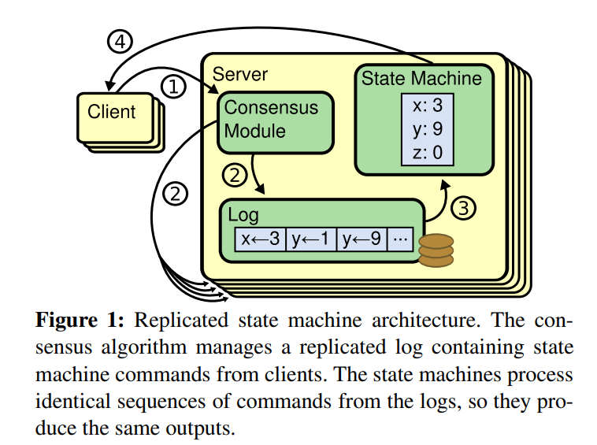
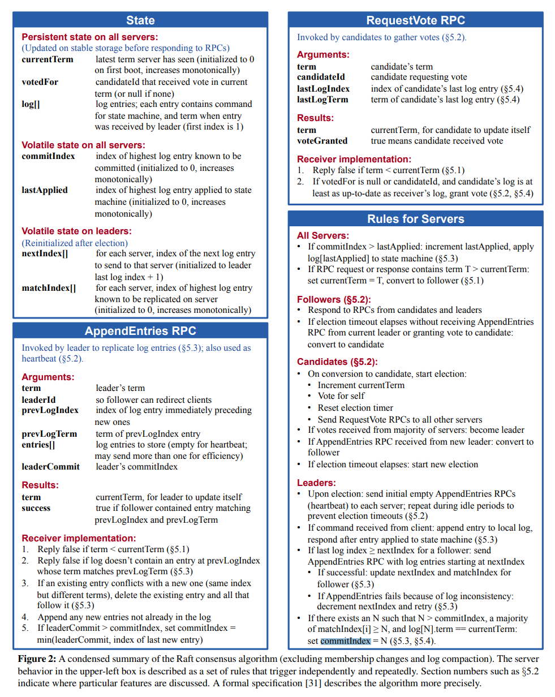
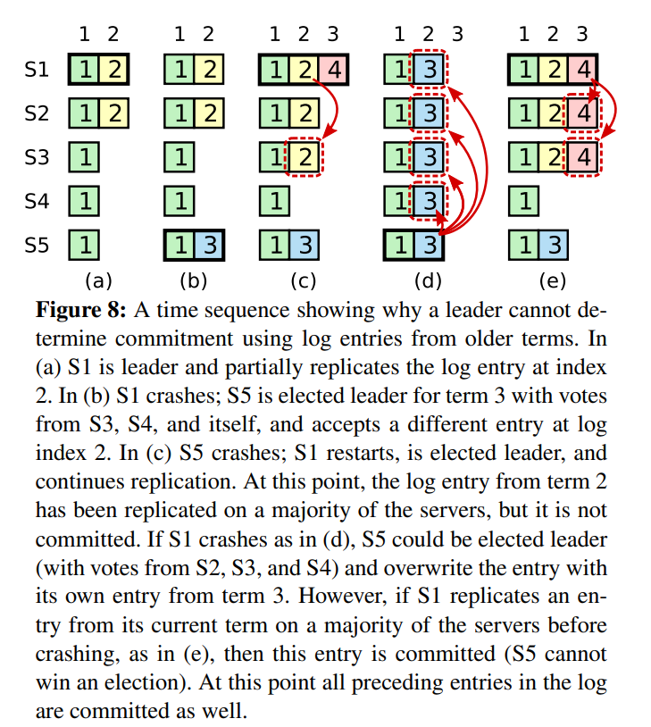
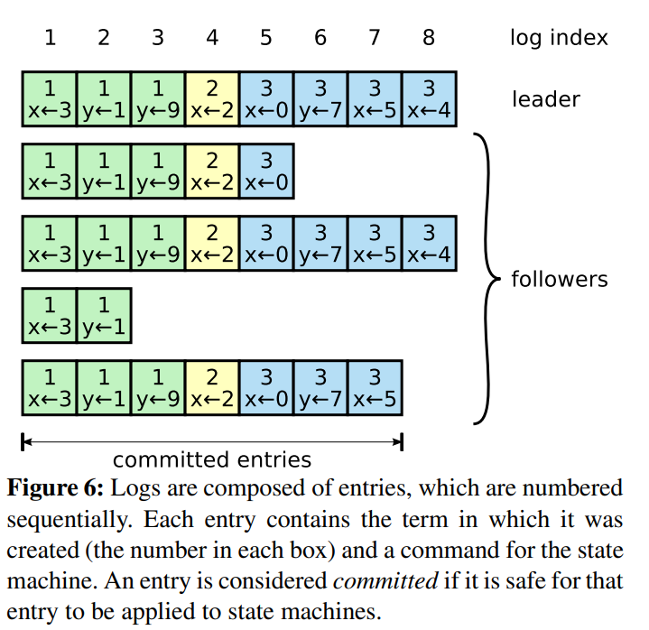
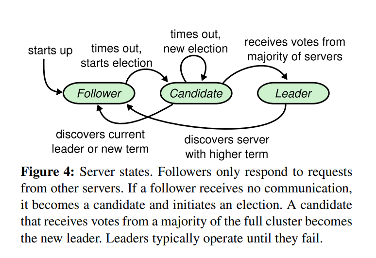
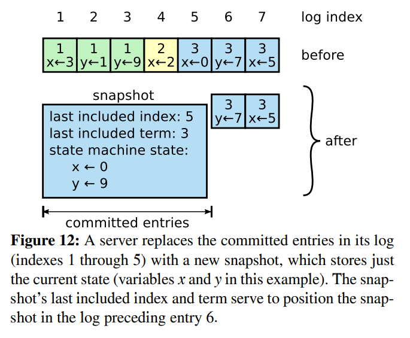

# Raft
Raft是一个管理replicated日志的共识（consensus）算法。共识算法允许一组机器作为一个相关的组工作，可以在其某些成员的失败中继续提供服务。 正因为如此，它们在构建可靠的大型软件系统方面发挥着关键作用。

## Replicated state machines

一组server上的状态机计算相同状态的相同副本，这样即使一些servers失败，也能继续运算。

Replicated state machine结构如下所示：

一种实现方式是维护相同log，结构图如上，其中维护这个log任务就是共识算法的责任。

## raft共识算法

流程：raft算法首先会选举出一个leader，然后会赋予这个leader管理replicated log的完全的责任。leader会从客户端接受log entries，把这些日志复制到其他的server当中，并告诉这些服务器什么时候能够安全地把日志apply到state machine当中。

raft算法准则如下图所示：

* 选举：完成选举只需要term和candidateId作为参数，但是为了保证选举出来的leader**Leader Completeness Property:给定term中包含所有之前term已经committed的entries**，所以需要lastLogIndex和lastLogTerm参数。当voter发现它自身的log更加up-to-date时会拒绝投票。
日志more up-to-date：通过比较最后entry的index和term，如果最后结束于不同的term，那么具有更高term的log更加up-to-date，如果term相同，那么log更长的更加up-to-date。
  * commitIndex设置：需要满足majority的matchIndex[i] >= N,并且log[N].term = currentTerm,leader才会设置commitIndex为N（N大于原来的commitIndex）。由此可以看到如果voter投票，比不可能有新的已经commited的log entry，如果有新的commited的entry，那么在大部分机器上有这个log，则不可能有大部分投票给candidate。
  * **curretTerm等于term也要判断是否正常投票。（是否也可以设置大于才能进行投票？）这里判断votedFor为null，是因为进入了新的term要更新votedFor**。
  * **当term大于currentTerm时是否要更新currentTerm，也就是是否可以把currentTerm的更新延迟到AppendEntries RPC中**
  * votedFor必须持久化，否则出现case：server为某一term期的candidate投票，server crush之后，重启后为同一term期的另一candidate投票，那么会出现同一term多个leader。
* case：如果设置commitIndex没有使用这个log[N].term = currentTerm的条件，那么会出现fig8描述的错误情况。
  

* commitIndex和lastApplied。commitIndex是知道被commited的最大的log index。lastApplied是被apply到状态机的最大的log index。如果commitIndex>lastApplied,那么增加lastApplied并把log apply到状态机当中,**server crush 之后变化？**

* nextIndex[] 和matchIndex[]， nextIndex[]是指被发送到每个sever下一个的log entry。初始化为last log index + 1，当appenEntries RPC因为日志不一致失败后，那么会逐步减少nextIndex，matchIndex是指知道被replicated的最大log index。leader会根据matchIndex等信息更新commitIndex。**这两个需要在选举后重新初始化，这样才能正确发送log到其他的server上同步。**

* AppendEntries:leader用于复制日志，也被用成heartbeat。**prevLogIndex和prevLogTerm的作用：**

因为使用leader的方法，raft把一致性算法分解成三个相对独立的子问题，分别是Leader Election、Log replication、Safety

### Leader Election
每一个term由选举开始，如果一个candidate赢得选举，它会成为那个term的leader。当term没有产生leader，那么一个新term的选举会马上开始，raft算法保证在一个特定的term中只有一个leader（**Election Safety**）（每一个server在一个给定的term只会vote for最多一个candidate + majority rule）

当candidate等待投票时，它可能收到AppendEntries，这时会根据leader的term来判断，如果term大于等于candidate的currentTerm，那么candidate就会变为follower，如果term小于candidate的currentTerm --> reject RPC

如果candidate既没有赢得也没有失败选举，那么会timeout，此时需要start new election

为了避免split votes现象，采用的方法是randomized election timeouts。

### Log replication

一旦leader被选举成功，那么它将开始为用户的请求提供服务。client的request包含一条要被状态机执行的指令。当leader把命令添加到log当中，将同时给其它server发送 AppendEntries RPCs来复制这个log entry。当log entry 被**safely replicated**，leader会apply这个entry到状态机并返回结果执行给客户端。就算leader已经回应了client，也会无尽重试发送AppendEntries RPC如果follower没有跟上日志。

log格式如下，如果把entry apply到状态机是安全的，log被认为是**commited**

leader决定何时将log entry apply到状态机是安全的,这样的条目称为commited。 Raft 保证提交的条目是持久的并最终由所有可用的状态机执行。

**Log Matching Property**：(1)如果两个在不同log中的log entry有相同的term和index，那么它们存储了相同的命令。（2）如果两个在不同log中的log entry有相同的term和index，那么它们之前的entries也相同。

### Safety
安全性中最重要的是State Machine Safety:如果任何server apply一个特定log entry到它的state machinie当中，那么没有其他的server能够在相同的log索引处apply一个不同的log entry。

## raft

server使用RPC同步信息,**Servers retry RPCs if they do not receive a response in a timely manner, and they issue RPCs in parallel for best performance(论文与实验不一致)**

Terms作为Raft的logical clock，有如下作用：（1）检测过时信息比如过时的leader （2）currentTerm，随着时间逐步增大，当server交流信息的时候，currentTerm会被交流，RequestVote RPC和AppendEntries RPC在参数和返回都有term这个属性。

term用于状态转换：leader和candicate发现更高的term，会变成follower。

## 日志压缩

使用快照来进行日志压缩。在快照中，整个现在的系统状态被写入snapshot，然后之前的log可以被丢弃。示意图如下：

## 与client的交互

raft的client会把请求发送给leader，那么client是怎么找到leader的呢？尝试！随机找一个server，如果这个server不是leader则会立马拒绝，并可以提供leader的信息(这个server知道的，也不一定对)，如果发生崩溃或者是过时的leader，那么请求回复就会timeout，client可以重试其他server。

设计使得raft实现线性语义（每个操作似乎在其调用和响应之间的某个时间点立即执行恰好一次），但是raft本身的协议可能使得一条命令执行多次（比如leader commit命令后崩溃，没有回应client，client会重新尝试，导致它第二次执行），可以通过分配一个唯一的序列号给每条命令来解决此问题。

对于只读请求，不用写入同步log也可以返回，但是没有而外的措施可能会返回过时的数据（因为这个leader有可能过时，但是它自身并不知道）。通过连个措施可以解决这个问题：(1)leader必须有commit log的最新信息，为了保证这一点**leader会在term开始时提交一个no-op的entry到log中**（2）leader应该在处理只读请求前通过心跳来检查它是否还是最新的leader。
